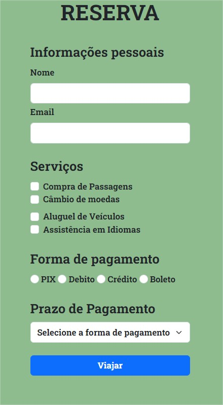

# ATIVIDADE PRÁTICA MÓDULO CONTINUÇÃO FORMULÁRIOS

## Título da Prática: Formulário de Reserva de Viagem Avançado



### Objetivo

O objetivo desta atividade é permitir que os alunos apliquem os conceitos aprendidos na aula “Continuação: formulários com HTML”, criando um formulário de reserva de viagem mais avançado que incorpora diferentes tipos de campos de entrada, incluindo caixas de seleção, botões de rádio e listas suspensas.

### Descrição da atividade

- 1º passo
  Crie uma nova página HTML chamada “reserva.html”.

- 2º passo
  Na página, você deve criar um formulário de reserva de viagem com os seguintes campos: Nome, Email, Serviços Desejados (uma caixa de seleção com opções como Compra de Passagens, Reserva de Hospedagem, Aluguel de Veículos), Forma de Pagamento (um botão de rádio com opções como Cartão de Crédito, Boleto, PIX) e Prazo de Pagamento (uma lista suspensa com opções como À Vista, Cinco Vezes Sem Juros, Dez Vezes Com Juros).

- 3º passo
  Utilize as tags:

  ```html
  <form>, <input>, <label>, <select>, <option>, <fieldset> e <textarea>
  ```

  para criar o formulário e seus campos.

- 4º passo
  Adicione semântica ao formulário utilizando a tag

  ```html
  <fieldset></fieldset>
  ```

  para agrupar os campos do formulário.

- 5º passo
  Adicione um botão de envio ao formulário utilizando a tag:

  ```html
  <input />
  ```

  com o tipo “submit”.

- 6º passo

  Salve seu trabalho e visualize a página no navegador.
